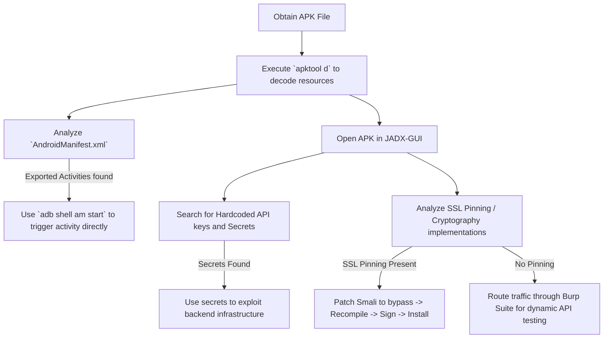

# Android APK Reverse Engineering

## When to Use
- When initiating a mobile application penetration test (Black-box or Gray-box).
- To discover hidden API endpoints, pre-production authentication tokens, or AWS credentials accidentally compiled into the release application.
- To understand how the application handles cryptography, SSL pinning, or local data storage before attempting dynamic instrumentation (e.g., Frida).

## Workflow

### Phase 1: Obtaining the APK

```bash
# Concept: Unless the client provides the APK directly, you must pull it from a physical 
# device or emulator, or download it from a third-party mirroring site (e.g., APKMirror).

# 1. Connect Android Device (via USB or Emulator)
adb devices

# 2. Locate the package name of the target app
adb shell pm list packages | grep "targetbank"
# Output: `package:com.bank.targetapp`

# 3. Find the physical path to the APK on the device
adb shell pm path com.bank.targetapp
# Output: `package:/data/app/~~xxxxx==/com.bank.targetapp-yyyyy==/base.apk`

# 4. Pull the APK to your local machine
adb pull /data/app/~~xxxxx==/com.bank.targetapp-yyyyy==/base.apk targetapp.apk
```

### Phase 2: Static Reconnaissance (Apktool)

```bash
# Concept: An APK is fundamentally a ZIP archive containing compiled Dalvik Executables (.dex),
# resources, and XML manifests. Apktool specifically decodes the binary `AndroidManifest.xml` 
# back to human-readable XML and decompiles the DEX into Smali (assembly-like code).

# 1. Decode the APK
apktool d targetapp.apk -o targetapp_source

# 2. Analyze the `AndroidManifest.xml`
# Specifically look for:
# - `android:allowBackup="true"` (Allows data extraction via adb backup)
# - `android:debuggable="true"` (Critical vulnerability allowing code injection)
# - Exported Activities: `<activity android:name=".HiddenAdminPanel" android:exported="true">` 
#   (Can be launched directly by other apps on the phone without logging in!)

# 3. Search for Hardcoded Secrets
grep -r "AKIA" targetapp_source/
grep -ir "password" targetapp_source/res/values/strings.xml
```

### Phase 3: Source Code Recovery (JADX)

```bash
# Concept: While Smali code (from Apktool) is useful for modifying the app, it is 
# incredibly difficult to read. We use JADX to decompile the DEX files back into 
# highly readable Java/Kotlin code.

# 1. Launch JADX GUI (or use the command line `jadx -d out targetapp.apk`)
jadx-gui targetapp.apk

# 2. Source Code Review Focus Areas:
# - Networking/API: Search for `Retrofit`, `OkHttp`, `baseUrl`.
# - Cryptography: Search for `Cipher.getInstance("AES/ECB`, `MessageDigest`. (ECB mode is insecure!)
# - SSL Pinning: Search for `TrustManager`, `checkServerTrusted`, or custom certificate validation logic.
# - Local Storage: Search for `SharedPreferences`, `SQLiteDatabase`, files written to `/sdcard`.

# 3. Understanding Control Flow:
# Trace how a user logs in. Right-click the `.login()` method and select "Find Usage" to 
# trace the backend API execution path to discover hidden API parameters.
```

### Phase 4: Recompiling and Signing (Patching)

```bash
# Concept: If you discovered SSL Pinning preventing Burp Suite from intercepting traffic, 
# you can modify the Smali code to bypass it, recompile the APK, and install the modified 
# version onto your device.

# 1. Bypass the pinning script (e.g., delete the exception throw in Smali).

# 2. Rebuild the APK
apktool b targetapp_source -o targetapp_patched_unsigned.apk

# 3. Generate a fake Developer Key
keytool -genkey -v -keystore my-release-key.keystore -alias alias_name -keyalg RSA -keysize 2048 -validity 10000

# 4. Sign the Modified APK
apksigner sign --ks my-release-key.keystore --out targetapp_patched.apk targetapp_patched_unsigned.apk

# 5. Install the Patched App
adb install targetapp_patched.apk

# You can now intercept traffic in Burp Suite unimpeded.
```

#### Decision Point 🔀


## 🔵 Blue Team Detection & Defense
- **ProGuard / R8 Obfuscation**: Enable rigorous code shrinking and obfuscation. By heavily obfuscating class names, variables, and methods (e.g., changing `Authenticator.login()` to `a.b()`), you drastically increase the time and effort required for an attacker relying on JADX to comprehend the application's business logic.
- **Root/Emulator Detection**: Implement runtime checks to determine if the application is running on a rooted device (e.g., checking for SuperSU or Magisk binaries) or an emulator (x86 architecture). Forcefully terminate the application to hinder dynamic analysis and traffic interception.
- **NDK (C/C++) Native Libraries**: Shift highly sensitive cryptographic algorithms, secret token generation, and SSL pinning logic out of Java/Kotlin and into native C/C++ libraries (`.so` files). Reverse engineering ARM assembly using IDA Pro/Ghidra is extraordinarily more complex than reading decompiled Java with JADX.

## Key Concepts
| Concept | Description |
|---------|-------------|
| APK | Android Package Kit; the identical file format utilized by the Android OS for the distribution and installation of mobile applications. Fundamentally a ZIP archive |
| Smali / Baksmali | An assembler/disassembler for the Dex format utilized by Dalvik/Android Runtime (ART). It represents the lowest-level readable code representation of an Android app |
| JADX | A premier decompilation tool that translates Dalvik bytecode (DEX) back into structurally accurate Java source code |
| SSL Pinning | A security mechanism where the application is hardcoded to exclusively trust a specific, known SSL certificate or public key, entirely rejecting the system's root certificate authorities (and thus blocking tools like Burp Suite) |

## Output Format
```
Mobile Configuration Review: Android Bank Application
=====================================================
Target: `com.company.banking.prod` (Version 2.4.1)
Severity: Critical (CVSS 9.1)

Description:
During the static reconnaissance phase of the mobile application assessment, the target APK was acquired and decompiled utilizing JADX. 

A thorough source code review of the `com.company.networking.APIConfig` class revealed the inclusion of hardcoded, production-tier Amazon Web Services (AWS) Identity and Access Management (IAM) credentials. 

```java
public class APIConfig {
    public static final String AWS_ACCESS_KEY = "AKIA1234567890ABCDEF";
    public static final String AWS_SECRET = "ZxyYxWwVvUuTtSsRrQqPpOoNnMmLlKkJjIiHhGgFf";
    public static final String S3_BUCKET_NAME = "prod-banking-user-receipts";
}
```

Impact:
The extraction of these credentials from the inherently untrusted, publicly distributed application binary permits a fully unauthenticated attacker to assume the associated AWS IAM Role. Utilizing the AWS CLI, the attacker achieved unfettered Read/Write access to the `prod-banking-user-receipts` S3 bucket, compromising the financial privacy of all active customers.
```

## References
- OWASP: [Mobile Security Testing Guide (MSTG)](https://owasp.org/www-project-mobile-security-testing-guide/)
- GitHub: [JADX - Dex to Java Decompiler](https://github.com/skylot/jadx)
- Apktool: [A tool for reverse engineering Android apk files](https://ibotpeaches.github.io/Apktool/)
